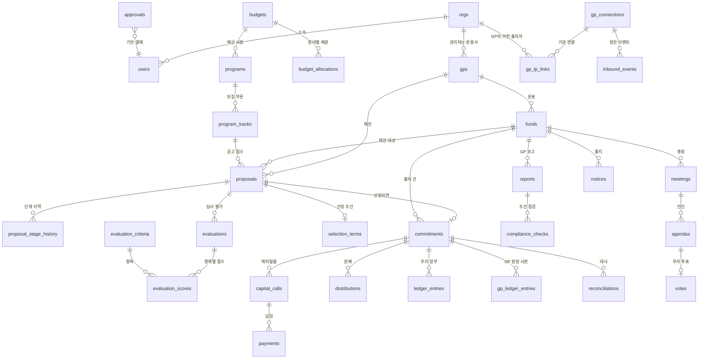

# 03. DB 설계 (확정)

> 기준 문서: [01 MVP 범위](01_mvp_scope.md), [02 용어 정의](02_glossary.md), [99 결정 기록](99_decisions.md)
> DB: PostgreSQL (Neon, **GP와 별도 DB**). 이 문서는 **무엇을, 왜 이렇게** 저장하는지를 다룬다.
> 저장된 데이터를 어떤 규칙으로 바꾸는지(검증, 상태 이동, 결재)는 04 비즈니스 규칙에서 다룬다.

---

## 1. 설계 원칙

### 원칙 1. 모든 데이터는 기관에 속한다 (L2)
기관이 만든 모든 테이블에 `org_id` 를 둔다. **부모·자식 테이블 모두** 둔다 (예: 출자사업과 모집 부문 둘 다).

그리고 자식이 부모를 가리킬 때 `(org_id, 부모 id)` 두 개를 함께 가리키게 한다 (**복합 외래 키**).

```
program_tracks (org_id = A기관, program_id = P1)
      └─ 가리킴 → programs (org_id = A기관, id = P1)   ✅
program_tracks (org_id = A기관, program_id = P2)
      └─ 가리킴 → programs (org_id = B기관, id = P2)   ❌ DB가 거부
```

> **왜?** 서버 코드가 기관 검사를 한 번 빠뜨려도, **A기관의 데이터가 B기관의 데이터에 연결되는 일은 DB가 막는다.**
> 여러 기관이 쓰는 서비스에서 가장 무서운 사고는 "다른 회사 데이터가 섞이는 것"이다. 막는 곳을 두 겹으로 둔다.
> - 1겹: 서버의 모든 조회·수정은 한 곳(`withOrg`)에서 로그인한 사용자의 `org_id` 를 조건으로 붙인다
> - 2겹: 복합 외래 키로 기관이 다른 행끼리 연결될 수 없다
> - (고도화) 3겹: DB의 행 단위 보안(RLS). MVP에서는 넣지 않는다 (L7)

### 원칙 2. 돈의 원본은 우리 장부 하나다 (GP 원칙 1과 같음)
우리 기관의 약정·납입·분배 금액은 `ledger_entries`(우리 장부)에만 저장한다.
누적 납입액, 남은 약정액, TVPI 같은 값은 **저장하지 않고 뷰에서 계산**한다 (6장).

### 원칙 3. 업무 문서와 장부를 나눈다 (GP 원칙 2와 같음)
- **업무 문서**: 캐피탈콜(요청을 받았다), 납입(보내기로 결재했다), 분배(받는다고 통지받았다)
- **장부**: 실제로 확정된 돈 (약정 확정, 실제 송금, 실제 수령)

캐피탈콜을 받았다고 돈이 나간 게 아니고, 결재가 났다고 돈이 나간 것도 아니다. **실제 송금을 기록할 때만** 장부에 한 줄이 생긴다.

### 원칙 4. 장부는 추가만 한다 (GP D5와 같음)
`ledger_entries`, `gp_ledger_entries` 는 수정·삭제를 DB 트리거로 막는다. 틀렸으면 반대 금액의 취소 행을 추가한다.

### 원칙 5. GP 데이터와 우리 데이터를 섞지 않는다 (L6)
- **GP 원장 사본**(`gp_ledger_entries`): GP가 준 숫자. 받은 그대로 저장하고 고치지 않는다
- **우리 장부**(`ledger_entries`): 우리가 결재하고 실제로 보낸·받은 돈
- 둘을 **대사**(`reconciliations`)로 맞춰본다. 두 숫자를 한 테이블에 섞으면 "누구 숫자가 틀렸는지"를 알 수 없다

캐피탈콜·분배·총회·보고·통지처럼 GP에서 오는 업무 문서는 수기 조합과 **같은 테이블**에 넣고 `data_source` 로 구분한다.
연동 행(`gp_api`)의 GP 쪽 컬럼은 **동기화만 바꿀 수 있고** 사용자는 바꿀 수 없다 (우리 쪽 컬럼인 메모·검토 의견·결재는 바꿀 수 있다).

### 원칙 6. 결정 시점의 값을 고정한다 (GP 원칙 4와 같음)
- 결재: 결재를 올린 시점의 금액·내용을 `approvals.snapshot` 에 저장 → 승인 후 원본이 바뀌어도 "무엇을 승인했는지" 남는다
- 심사 평가: 평가 당시의 항목 이름·가중치를 점수 행에 복사
- 대사: 비교한 시점의 두 합계를 그대로 저장
- 청산: 출자 건이 끝날 때 최종 성과 지표를 저장

---

## 2. 전체 구조 (ERD)

> VS Code에서 그림을 보려면 Mermaid 미리보기 확장이 필요하다 (GitHub에서는 바로 보인다).
> 모든 테이블이 `orgs` 에 연결되지만 그림이 복잡해져 선을 생략했다.



### 영역별 요약

| 영역 | 테이블 | 단계 |
|---|---|---|
| 기관·계정 | `orgs`, `users`, `sessions` | 공통 |
| 운용사·조합 | `gps`, `funds` | 공통 |
| 출자 계획 | `budgets`, `budget_allocations` | 1. 계획 |
| 출자사업·제안 | `programs`, `program_tracks`, `proposals`, `proposal_stage_history` | 2. 발굴 |
| 심사·선정 | `evaluation_criteria`, `evaluations`, `evaluation_scores`, `selection_terms` | 3. 심사 |
| 결재 | `approvals` | 3, 5, 6 |
| 출자 건·장부 | `commitments`, `ledger_entries` | 4 ~ 7 |
| 납입 | `capital_calls`, `payments` | 5. 납입 |
| GP 사본·대사 | `gp_ledger_entries`, `reconciliations` | 4 ~ 7 |
| 사후관리 | `reports`, `compliance_checks`, `meetings`, `agendas`, `votes`, `notices`, `attachments` | 6. 사후관리 |
| 분배 | `distributions` | 7. 회수 |
| GP 연동 | `gp_connections`, `gp_lp_links`, `inbound_events` | 전 단계 |
| 공통 | `audit_logs`, `idempotency_keys`, `scheduled_jobs` | 전 단계 |

테이블 36개, 계산용 뷰 5개.

---

## 3. 공통 컬럼과 자료형

GP 03 3장과 같다: 기본 키 `uuid`, `created_at` / `updated_at` / `created_by`, 금액 `bigint`(원 단위), 비율 `numeric(7,6)`, 상태·구분값 `text` + `check` 제약.

LP ERP에 더하는 것:

| 컬럼 | 자료형 | 설명 |
|---|---|---|
| `org_id` | `uuid` → `orgs` | 기관이 만든 모든 테이블에 필수. `orgs`, `gp_connections`, `inbound_events`, `scheduled_jobs` 만 예외 |
| `(org_id, id)` 유일 | | 복합 외래 키가 가리킬 수 있게 모든 기관 테이블에 둔다 (원칙 1) |
| `data_source` | `text` | `gp_api` / `manual`. GP에서 받을 수 있는 테이블에만 |
| `gp_..._id` | `uuid` | GP 시스템의 ID. `(org_id, gp_..._id)` 유일 → 같은 GP 데이터를 두 번 넣지 않는다 |

---

## 4. 테이블 상세

> 표기: 🔑 기본 키 · 🔗 외래 키 · ❗ 필수 값 · ✨ 유일해야 함
> 모든 기관 테이블에 있는 `org_id`, `created_at`, `updated_at`, `created_by` 는 특별한 뜻이 없으면 생략한다.

### 4-1. 기관 · 계정

#### `orgs` — 기관
| 컬럼 | 자료형 | 설명 |
|---|---|---|
| 🔑 `id` | uuid | |
| ❗ `name` | text | 기관명 |
| ❗ `org_type` | text | `policy` / `pension` / `financial` / `corporate` / `other` |

#### `users` — 사용자
| 컬럼 | 자료형 | 설명 |
|---|---|---|
| 🔑 `id` | uuid | |
| ❗🔗 `org_id` | uuid → orgs | 한 사용자는 한 기관에만 속한다 |
| ❗ `email` | text ✨ | 로그인 ID. **서비스 전체에서** 유일 (로그인할 때 기관을 고르지 않아도 되게) |
| ❗ `name` | text | |
| ❗ `role` | text | `admin` / `officer` / `approver` / `viewer` |
| `disabled_at` | timestamptz | 채워지면 로그인 불가 |

#### `sessions` — 로그인 세션 (GP D27과 같은 방식)
`id`, `user_id`, `token_hash` ✨, `expires_at`. 세션에서 사용자를 찾으면 기관도 정해진다 → **요청마다 기관 ID는 세션에서만 얻는다** (주소·본문으로 받은 기관 ID는 믿지 않는다).

### 4-2. 운용사 · 조합

#### `gps` — 운용사
| 컬럼 | 자료형 | 설명 |
|---|---|---|
| 🔑 `id` | uuid | |
| ❗ `name` | text | `(org_id, name)` ✨ |
| ❗ `gp_type` | text | 🔗 GP의 `gp_type` 값 |
| `aum_amount` | bigint | 운용 규모 (입력값) |
| `contact_name`, `contact_email`, `contact_phone` | text | GP 담당자 |
| 🔗 `gp_connection_id` | uuid → gp_connections | 연동 GP면 채움. 수기 GP는 비움 |
| `memo` | text | |

> **설계 의도**: 같은 운용사라도 **기관마다 따로** 등록한다. A기관이 적은 GP 메모·평가가 B기관에 보이면 안 되기 때문이다.
> 연동 여부는 운용사 단위로 정한다. 연동 GP면 그 GP의 조합은 모두 `data_source = gp_api` 가 된다.

#### `funds` — 조합
| 컬럼 | 자료형 | 설명 |
|---|---|---|
| 🔑 `id` | uuid | |
| ❗🔗 `gp_id` | uuid → gps | |
| ❗ `name` | text | |
| ❗ `fund_type` | text | 🔗 GP의 `fund_type` 값 |
| ❗ `strategy` | text | `early` / `growth` / `secondary` / `overseas` / `other` (분야) |
| ❗ `status` | text | 🔗 GP의 `fund_status` 값 |
| `target_amount` | bigint | 목표 결성액 (제안서 기준) |
| `fund_size_amount` | bigint | 결성액. 결성 전엔 비움 |
| `formation_date` | date | |
| `vintage_year` | integer | 결성일의 연도 (DB가 자동 계산, 생성 컬럼) |
| `term_years`, `investment_period_years` | integer | 존속·투자 기간 |
| `management_fee_rate`, `carry_rate`, `hurdle_rate` | numeric | 제안·규약 조건 (참고용, LP가 계산하지는 않음) |
| `primary_purpose`, `primary_purpose_min_ratio` | text, numeric | 주목적 분야와 의무 비율 → 조건 준수 점검의 기준 |
| ❗ `data_source` | text | `gp_api` / `manual` |
| `gp_fund_id` | uuid | 연동 조합의 GP 쪽 ID. `(org_id, gp_fund_id)` ✨ |
| `last_synced_at` | timestamptz | 연동 조합을 마지막으로 GP와 맞춘 시각 |

> **설계 의도**: 조합은 **출자 제안을 받는 순간** 만들어진다 (상태 `planning` 또는 `fundraising`). 선정되지 않아도 "검토했던 조합"으로 남는다.
> 결성액·결성일은 결성 확인 때 채운다. 연동 조합은 GP에서 받은 값으로 채우고 사용자가 고칠 수 없다.

### 4-3. 출자 계획

#### `budgets` — 출자 예산
| 컬럼 | 자료형 | 설명 |
|---|---|---|
| 🔑 `id` | uuid | |
| ❗ `budget_year` | integer | `(org_id, budget_year)` ✨ 한 해에 예산 하나 |
| ❗ `total_amount` | bigint | 그해 선정할 수 있는 총액 |
| `memo` | text | |

#### `budget_allocations` — 분야별 배분
| 컬럼 | 자료형 | 설명 |
|---|---|---|
| 🔑 `id` | uuid | |
| ❗🔗 `budget_id` | uuid → budgets | 복합 외래 키 `(org_id, budget_id)` |
| ❗ `strategy` | text | `(budget_id, strategy)` ✨ |
| ❗ `amount` | bigint | 배분 합계가 예산 총액을 넘지 않는다 (04에서 검사) |

> **설계 의도**: "예산을 얼마나 썼는지"는 저장하지 않는다. 그해 예산으로 선정된 `selection_terms.planned_amount` 합계로 계산한다 (`v_budget_usage`).

### 4-4. 출자사업 · 출자 제안

#### `programs` — 출자사업
| 컬럼 | 자료형 | 설명 |
|---|---|---|
| 🔑 `id` | uuid | |
| ❗🔗 `budget_id` | uuid → budgets | 어느 해 예산으로 선정하는지 |
| ❗ `name` | text | |
| ❗ `apply_start_date`, `apply_end_date` | date | 접수 기간 |
| ❗ `status` | text | `draft`(작성) → `open`(접수 중) → `reviewing`(심사 중) → `closed`(선정 완료) |

#### `program_tracks` — 모집 부문
| 컬럼 | 자료형 | 설명 |
|---|---|---|
| 🔑 `id` | uuid | |
| ❗🔗 `program_id` | uuid → programs | |
| ❗ `name` | text | 예: "초기 부문" |
| ❗ `strategy` | text | |
| ❗ `planned_amount` | bigint | 부문 출자 예정액 |
| ❗ `target_gp_count` | integer | 선정할 GP 수 |
| `min_fund_size_amount` | bigint | 최소 결성 규모 |
| `max_commitment_ratio` | numeric | 출자 비율 상한 |

#### `proposals` — 출자 제안
| 컬럼 | 자료형 | 설명 |
|---|---|---|
| 🔑 `id` | uuid | |
| ❗🔗 `gp_id` | uuid → gps | |
| ❗🔗 `fund_id` | uuid → funds | `(org_id, fund_id)` ✨ 한 조합에 제안 1건 (🔗 GP의 `(fund_id, lp_id)` 유일과 같음) |
| ❗ `proposal_channel` | text | `program` / `direct` |
| 🔗 `program_track_id` | uuid → program_tracks | `program` 이면 필수, `direct` 면 비움 (check 제약) |
| ❗ `requested_amount` | bigint | 요청 출자액 |
| ❗ `received_date` | date | |
| ❗ `status` | text | `received` / `screening` / `due_diligence` / `presentation` / `committee` / `selected` / `rejected` / `withdrawn` |
| `decided_date` | date | 선정·탈락·철회한 날 |
| ❗ `data_source` | text | |
| `gp_proposal_id` | uuid | 연동 GP의 출자 제안 ID. `(org_id, gp_proposal_id)` ✨ |
| `gp_response_sent_at` | timestamptz | 선정·탈락 결과를 GP에 전달한 시각 (L5) |
| `memo` | text | 내부 메모. GP에 보내지 않는다 |

#### `proposal_stage_history` — 단계 이력
`proposal_id`, `from_status`, `to_status`, `changed_at`, `changed_by`, `note`. 추가만.

> **설계 의도**: 🔗 GP의 딜 단계 이력(`deal_stage_history`)과 같은 구조다. "언제 서류 심사를 통과했는지"를 나중에 볼 수 있다.

### 4-5. 심사 · 선정

#### `evaluation_criteria` — 평가 항목
| 컬럼 | 자료형 | 설명 |
|---|---|---|
| 🔑 `id` | uuid | |
| ❗ `name` | text | 예: 운용 인력 |
| ❗ `weight_ratio` | numeric | 사용 중인 항목의 합계 = 1 (04에서 검사) |
| ❗ `sort_order` | integer | |
| `retired_at` | timestamptz | 더 이상 쓰지 않는 항목. 과거 평가는 남는다 |

#### `evaluations` — 평가표
| 컬럼 | 자료형 | 설명 |
|---|---|---|
| 🔑 `id` | uuid | |
| ❗🔗 `proposal_id` | uuid → proposals | |
| ❗🔗 `evaluator_id` | uuid → users | |
| ❗ `stage` | text | 어느 심사 단계의 평가인지 (`screening` / `presentation` 등) |
| ❗ `evaluated_date` | date | |
| `opinion` | text | 종합 의견 |
| | | `(proposal_id, evaluator_id, stage)` ✨ 한 심사위원은 한 단계에 한 번 |

#### `evaluation_scores` — 항목별 점수
| 컬럼 | 자료형 | 설명 |
|---|---|---|
| 🔑 `id` | uuid | |
| ❗🔗 `evaluation_id` | uuid → evaluations | |
| ❗🔗 `criterion_id` | uuid → evaluation_criteria | `(evaluation_id, criterion_id)` ✨ |
| ❗ `criterion_name`, `weight_ratio` | text, numeric | 평가 당시 값 복사 (원칙 6) |
| ❗ `score` | integer | 0~100 |

#### `selection_terms` — 선정 조건
| 컬럼 | 자료형 | 설명 |
|---|---|---|
| 🔑 `id` | uuid | |
| ❗🔗 `proposal_id` | uuid → proposals | ✨ 제안 하나에 하나 |
| ❗🔗 `budget_id` | uuid → budgets | 어느 해 예산을 쓰는지 |
| ❗ `planned_amount` | bigint | 출자 예정액 (= GP에 보내는 확약 금액) |
| `max_commitment_ratio` | numeric | 출자 비율 상한 |
| ❗ `formation_deadline` | date | 결성 기한 |
| `key_person_condition` | text | 핵심 운용 인력 유지 조건 |
| `locked_at` | timestamptz | 선정 결재가 승인되면 채움. 이후 수정 불가 |

> **설계 의도**: 선정 조건은 **결재를 올리기 전에 작성**하고, 승인되면 잠근다. 반려되면 고쳐서 다시 올린다.
> 그래서 제안(`proposals`)과 따로 둔다. 제안은 GP가 준 내용이고, 선정 조건은 우리가 정한 내용이다.

### 4-6. 결재 (L4)

#### `approvals` — 결재
| 컬럼 | 자료형 | 설명 |
|---|---|---|
| 🔑 `id` | uuid | |
| ❗ `target_type` | text | `selection`(대상: 제안) / `payment`(대상: 납입) / `vote`(대상: 총회) |
| ❗ `target_id` | uuid | 대상 ID |
| ❗ `status` | text | `pending` / `approved` / `rejected` |
| ❗🔗 `requested_by` | uuid → users | 기안자 |
| ❗ `requested_at` | timestamptz | |
| `request_comment` | text | 기안 의견 |
| ❗ `snapshot` | jsonb | 기안 시점의 결재 내용 (금액, 조건, 찬반 등) |
| 🔗 `approver_id` | uuid → users | 결재자. `requested_by` 와 달라야 함 (check 제약) |
| `decided_at` | timestamptz | |
| `decision_comment` | text | 반려 사유 등 |

> **설계 의도**
> - 결재 대상 세 가지를 **테이블 하나**로 다룬다. 결재함 화면 하나에서 "내가 결재할 것"을 모두 볼 수 있다.
> - 한 대상에 결재 대기는 하나만 (`(target_type, target_id)` where `status = 'pending'` 부분 유일 인덱스).
> - 반려돼도 행은 남고, 다시 올리면 새 행이 생긴다 → 결재 이력 전체가 남는다.
> - 대상이 여러 테이블이라 `target_id` 는 외래 키를 걸 수 없다. 대신 서버가 대상의 `org_id` 가 결재의 `org_id` 와 같은지 검사한다.

### 4-7. 출자 건 · 장부

#### `commitments` — 출자 건
| 컬럼 | 자료형 | 설명 |
|---|---|---|
| 🔑 `id` | uuid | |
| ❗🔗 `fund_id` | uuid → funds | `(org_id, fund_id)` ✨ 한 조합에 출자 건 하나 |
| ❗🔗 `proposal_id` | uuid → proposals | ✨ 어느 제안에서 선정됐는지 |
| ❗ `status` | text | `awaiting_formation` / `active` / `cancelled` / `closed` |
| `confirmed_date` | date | 결성 확인일 (`active` 가 된 날) |
| `cancelled_date`, `cancel_reason` | date, text | 선정 취소 |
| `closed_date` | date | |
| `final_metrics` | jsonb | 청산 때 고정한 최종 TVPI·DPI·IRR (원칙 6) |

> **설계 의도**: 선정 결재가 승인되면 만들어진다. 약정·납입·분배·대사·성과가 모두 이 행에 붙는다.
> **약정액은 여기에 저장하지 않는다.** 결성 확인 때 장부에 `commitment` 행으로 남기고 뷰에서 계산한다 (원칙 2). 약정이 바뀌면(규약 변경 등) 취소 행 + 새 행.

#### `ledger_entries` — 우리 장부
| 컬럼 | 자료형 | 설명 |
|---|---|---|
| 🔑 `id` | uuid | |
| ❗🔗 `commitment_id` | uuid → commitments | |
| ❗ `entry_type` | text | `commitment` / `contribution` / `distribution` |
| ❗ `amount` | bigint | 양수. 취소 행만 음수 |
| ❗ `entry_date` | date | 약정 확정일, 송금일, 수령일 |
| ❗ `source_type`, `source_id` | text, uuid | `commitment_confirmation` / `payment` / `distribution` |
| 🔗 `reversal_of_id` | uuid → ledger_entries | |
| `memo` | text | |

> **설계 의도**: 🔗 GP의 `ledger_entries` 와 **같은 모양**으로 만들었다. 그래서 대사할 때 `entry_type` 별 합계를 그대로 비교할 수 있다.

### 4-8. 납입

#### `capital_calls` — 캐피탈콜
| 컬럼 | 자료형 | 설명 |
|---|---|---|
| 🔑 `id` | uuid | |
| ❗🔗 `commitment_id` | uuid → commitments | |
| ❗ `call_no` | integer | `(commitment_id, call_no)` ✨. 🔗 GP의 회차 (GP 연동 API가 캐피탈콜 ID 대신 회차를 주므로 회차로 맞춘다) |
| `is_initial` | boolean | 최초 납입 여부 |
| ❗ `call_date`, `due_date` | date | |
| ❗ `call_amount` | bigint | 우리에게 요청된 금액 |
| `purpose` | text | |
| ❗ `data_source` | text | |
| `gp_payment_status` | text | GP가 본 우리 납입 상태 (🔗 GP의 `payment_status`). 연동만 |
| `cancelled_at` | timestamptz | GP가 취소한 요청 |

> **설계 의도**: 우리 쪽 납입 상태(결재 대기·송금 완료 등)는 저장하지 않고 `payments` 에서 계산한다.
> GP가 본 납입 상태(`gp_payment_status`)는 따로 둔다 → "우리는 보냈는데 GP는 미납으로 본다"를 찾을 수 있다.

#### `payments` — 납입
| 컬럼 | 자료형 | 설명 |
|---|---|---|
| 🔑 `id` | uuid | |
| ❗🔗 `capital_call_id` | uuid → capital_calls | |
| ❗ `amount` | bigint | 보낼(보낸) 금액 |
| `planned_date` | date | 송금 예정일 |
| ❗ `status` | text | `requested`(결재 대기) → `approved`(송금 대기) → `paid`(송금 완료) / `rejected`(반려) / `cancelled` |
| `paid_date` | date | 실제 송금일. `paid` 면 필수 |
| `bank_reference` | text | 이체 확인 번호 등 |

> **설계 의도**: 결재와 송금을 나눈다. 승인됐다고 돈이 나간 게 아니다.
> `paid` 가 되는 순간 같은 트랜잭션으로 장부에 `contribution` 행을 추가하고 대사를 다시 한다.
> 한 캐피탈콜을 나눠 낼 수 있게(분할 납입) 캐피탈콜 하나에 납입 여러 건을 허용한다 (L9).

### 4-9. GP 원장 사본 · 대사 (L6)

#### `gp_ledger_entries` — GP 원장 사본
| 컬럼 | 자료형 | 설명 |
|---|---|---|
| 🔑 `id` | uuid | |
| ❗🔗 `commitment_id` | uuid → commitments | |
| ❗ `gp_entry_id` | uuid | `(org_id, gp_entry_id)` ✨ GP 원장 행 ID. 같은 행을 두 번 넣지 않는다 |
| ❗ `entry_type` | text | |
| ❗ `amount` | bigint | |
| ❗ `entry_date` | date | |
| ❗ `gp_source` | jsonb | GP가 준 원인 정보 그대로 (예: `{ "type": "capital_call", "call_no": 2 }`) |
| `gp_reversal_of_id` | uuid | GP의 취소 대상 행 ID |
| ❗ `synced_at` | timestamptz | |

> **설계 의도**: GP 원장도 추가만 되므로(GP D5) 사본도 추가만 한다. 받은 행을 고칠 일이 없다.
> 수기 조합에는 이 테이블 행이 없다 → 대사는 연동 조합만 한다.

#### `reconciliations` — 대사
| 컬럼 | 자료형 | 설명 |
|---|---|---|
| 🔑 `id` | uuid | |
| ❗🔗 `commitment_id` | uuid → commitments | |
| ❗ `entry_type` | text | 무엇을 비교했는지 (약정 / 납입 / 분배) |
| ❗ `checked_at` | timestamptz | |
| ❗ `our_amount`, `gp_amount` | bigint | 비교 당시의 두 합계 |
| ❗ `recon_status` | text | `matched` / `mismatched` / `resolved` |
| `resolution_memo` | text | `resolved` 면 필수 |
| 🔗 `resolved_by` | uuid → users | |

> **설계 의도**: 우리 장부나 GP 사본이 바뀔 때마다 **새 행을 추가**한다 (덮어쓰지 않음). 가장 최근 행이 현재 상태다 (`v_recon_current`).
> 그래서 "언제부터 어긋났고, 누가 무슨 이유로 확인했는지"가 남는다.
> ⚠️ 송금한 날과 GP가 입금을 확인한 날이 달라 잠깐 어긋나는 것은 정상이다. 몇 일까지 기다릴지는 04에서 정한다.

### 4-10. 사후관리

#### `reports` — GP 보고
| 컬럼 | 자료형 | 설명 |
|---|---|---|
| 🔑 `id` | uuid | |
| ❗🔗 `fund_id` | uuid → funds | |
| ❗ `period_type` | text | 🔗 GP 값: `monthly` / `quarterly` / `semiannual` / `annual` |
| ❗ `period_start`, `period_end` | date | |
| ❗ `is_correction` | boolean | 같은 기간에 먼저 받은 보고를 고친 정정 보고 (🔗 GP의 `is_correction`) |
| `superseded_at` | timestamptz | 더 새로운 정정 보고가 들어와 대체된 시각. 성과·점검은 대체되지 않은 보고만 쓴다 |
| `received_date` | date | |
| `gp_comment` | text | |
| `snapshot` | jsonb | GP가 보낸 조합 숫자 그대로 (연동) |
| `nav_amount` | bigint | 기준일(`period_end`) 현재 **우리 몫** 평가액 |
| ❗ `data_source` | text | |
| `gp_report_id` | uuid | `(org_id, gp_report_id)` ✨ |
| `reviewed_at`, 🔗 `reviewed_by` | | 담당자 검토 완료 |

> **설계 의도**: 같은 기간 보고가 여러 건일 수 있다 (정정 보고). 지우지 않고 이전 보고에 대체 시각을 남긴다. 기간당 **대체되지 않은 보고는 하나** (`(fund_id, period_type, period_end)` where `superseded_at is null` 부분 유일 인덱스).
> **설계 의도**: 평가액(NAV)은 보고서에 딸린 숫자로 저장한다. 따로 입력하게 하면 "근거 없는 평가액"이 생긴다.
> 성과 지표의 평가액 = 성과 기준일 이전 가장 최근 보고의 `nav_amount`.
> 연동 조합의 우리 몫 평가액은 **GP가 계산해서 준다** (L8). GP 연동 API의 보고 응답에 우리 몫 평가액을 추가한다 (5-3). 수기 조합은 담당자가 보고서 숫자를 입력한다.

#### `compliance_checks` — 조건 준수 점검
| 컬럼 | 자료형 | 설명 |
|---|---|---|
| 🔑 `id` | uuid | |
| ❗🔗 `report_id` | uuid → reports | 어느 보고서 숫자로 점검했는지 |
| ❗ `check_type` | text | `primary_purpose`(주목적 투자 비율) / `other` |
| `required_ratio`, `actual_ratio` | numeric | |
| ❗ `result` | text | `pass` / `fail` |
| `memo` | text | |

#### `meetings` — 총회 · `agendas` — 안건 · `votes` — 우리 투표
| 테이블 | 주요 컬럼 |
|---|---|
| `meetings` | `fund_id`, `meeting_type`, `meeting_date`, `status`, `voting_open`, `data_source`, `gp_meeting_id` ✨ |
| `agendas` | `meeting_id`, `agenda_no`, `agenda_type`, `title`, `result`(GP가 확정한 가결·부결), `review_opinion`(내부 의견), `gp_agenda_id` ✨ |
| `votes` | `agenda_id` ✨(기관당 안건 하나에 한 표), `choice`, `submitted_at`(GP 제출 시각), `gp_vote_channel`(GP에 기록된 경로) |

> **설계 의도**: 🔗 GP는 총회 단위로 모든 안건의 표를 한 번에 받는다(`PUT …/meetings/{id}/votes`). 그래서 결재도 **총회 단위**(`approvals.target_type = vote`, 대상 = 총회)로 올린다.
> 승인되면 연동 GP에 바로 제출하고, 수기 조합은 "서면 제출 완료"로 기록한다.

#### `notices` — 통지
`fund_id`(없을 수 있음, 조합원이 되기 전 출자 제안), `notice_type`, `title`, `body`, `sent_at`, `acknowledged_at`, `acknowledged_by`, `gp_ack_sent_at`(확인을 GP에 전달한 시각), `data_source`, `gp_notice_id` ✨

#### `attachments` — 파일 첨부
`target_type`(`proposal` 제안서 / `report` 보고서), `target_id`, 파일 정보, 비공개 Blob 경로. GP D41과 같은 방식.
연동 GP의 PDF는 **복사하지 않고** 볼 때 GP 연동 API로 받아 그대로 흘려보낸다 (`gp_attachment_id` 만 저장).

### 4-11. 분배

#### `distributions` — 분배
| 컬럼 | 자료형 | 설명 |
|---|---|---|
| 🔑 `id` | uuid | |
| ❗🔗 `commitment_id` | uuid → commitments | |
| ❗ `distribution_no` | integer | `(commitment_id, distribution_no)` ✨. 🔗 GP 회차 (캐피탈콜과 같은 이유) |
| ❗ `distribution_date` | date | GP가 정한 분배일 |
| ❗ `amount` | bigint | 우리 몫 합계 |
| `return_of_capital_amount`, `profit_amount` | bigint | 원금 반환 / 수익 |
| `gp_components` | jsonb | GP 워터폴 단계별 금액 그대로 (연동) |
| ❗ `status` | text | `announced`(통지받음) → `received`(수령) / `cancelled`(GP가 취소) |
| `received_date` | date | `received` 면 필수. 이때 장부에 `distribution` 행 추가 |
| ❗ `data_source` | text | |

### 4-12. GP 연동

#### `gp_connections` — GP 연동 (서비스 운영자가 관리)
| 컬럼 | 자료형 | 설명 |
|---|---|---|
| 🔑 `id` | uuid | |
| ❗ `name` | text | 예: "VC ERP (GP) 데모" |
| ❗ `base_url` | text | GP 연동 API 주소 |
| ❗ `api_key_env`, `webhook_secret_env` | text | **비밀 값 자체가 아니라 환경 변수 이름**을 저장 (예: `GP_DEMO_API_KEY`) |
| `last_gp_event_id` | uuid | 놓친 이벤트를 받을 때의 시작 위치 |
| `last_pulled_at` | timestamptz | |

> **설계 의도**: API 키를 DB에 두면 DB가 새는 순간 GP 데이터까지 새어 나간다. 비밀 값은 서버 환경 변수에만 두고, DB는 "어느 변수를 쓸지"만 안다 (GP D24와 같은 원칙).
> `org_id` 가 없다. 연동은 LP ERP 전체와 GP 하나의 연결이기 때문이다 (01 5-3).

#### `gp_lp_links` — 기관 연결
| 컬럼 | 자료형 | 설명 |
|---|---|---|
| 🔑 `id` | uuid | |
| ❗🔗 `org_id` | uuid → orgs | `(org_id, gp_connection_id)` ✨ 한 GP에서 기관은 출자자 하나 |
| ❗🔗 `gp_connection_id` | uuid → gp_connections | |
| ❗ `gp_lp_id` | uuid | GP 시스템의 출자자 ID. `(gp_connection_id, gp_lp_id)` ✨ GP 출자자 하나는 기관 하나에만 |
| ❗🔗 `gp_id` | uuid → gps | 이 기관의 운용사 목록에서 이 GP |

> **설계 의도**: **기관 분리의 연동 쪽 핵심**이다. GP API 키 하나로 모든 출자자의 데이터를 부를 수 있으므로,
> LP ERP 서버는 GP를 부를 때 반드시 "로그인한 기관의 `gp_lp_id`" 를 이 표에서 꺼내 쓴다. 주소나 화면에서 받은 `lp_id` 는 쓰지 않는다.
> 양쪽 유일 제약 두 개로 "한 기관이 두 출자자에 연결" 또는 "한 출자자가 두 기관에 연결"을 DB가 막는다.

#### `inbound_events` — 받은 이벤트
| 컬럼 | 자료형 | 설명 |
|---|---|---|
| 🔑 `id` | uuid | |
| ❗🔗 `gp_connection_id` | uuid → gp_connections | |
| ❗ `gp_event_id` | uuid | `(gp_connection_id, gp_event_id)` ✨ **중복 수신을 DB가 거른다** |
| ❗ `event_type` | text | 예: `ledger.entry_created` |
| `gp_lp_id`, `gp_fund_id` | uuid | 이벤트 대상 (조합 전체 이벤트면 `gp_lp_id` 없음) |
| ❗ `payload` | jsonb | 받은 본문 그대로 |
| ❗ `received_via` | text | `webhook` / `pull` |
| ❗ `status` | text | `received` / `processed` / `failed` / `ignored` |
| ❗ `attempts` | integer | |
| `last_error` | text | |
| `processed_at` | timestamptz | |

> **설계 의도 (받는 쪽 아웃박스, "인박스")**
> 1. 웹훅이 오면 **서명 확인 → 이 테이블에 저장 → 바로 200 응답**. 무거운 처리는 하지 않는다 (GP가 10초 안에 답을 기다리므로)
> 2. 별도 처리 작업이 `received` 행을 순서대로 처리한다
> 3. 같은 이벤트가 두 번 와도 유일 제약에 걸려 한 번만 저장된다
> 4. 조합 전체 이벤트(`fund.updated` 등)는 그 조합에 연결된 모든 기관에 반영한다. 연결된 기관이 없으면 `ignored`

#### `audit_logs`, `idempotency_keys`, `scheduled_jobs`
GP의 같은 테이블과 같은 구조. `audit_logs`, `idempotency_keys` 에는 `org_id` 를 더한다 (감사 로그도 기관별로만 보인다).
`scheduled_jobs` 는 이벤트 처리·놓친 이벤트 가져오기 작업의 실행 잠금에 쓴다.

---

## 5. GP 데이터를 받는 방식 (동기화)

### 5-1. 이벤트는 신호, 데이터는 API로 다시 읽는다

GP 이벤트는 "무엇이 바뀌었다"만 알려준다. 이벤트 본문으로 데이터를 만들지 않고, **이벤트를 받으면 해당 자료를 GP 연동 API로 다시 읽어서** 저장한다.

> **왜?** 이벤트가 순서가 뒤바뀌거나 하나 빠져도, API로 다시 읽은 값은 항상 GP의 현재 상태다.
> 같은 이벤트를 두 번 처리해도 결과가 같다 (멱등).

| GP 이벤트 | 다시 읽는 GP API | LP ERP에 반영 |
|---|---|---|
| `notice.sent` | `GET /lps/{lp}/notices` | `notices` 추가. 종류에 따라 아래도 함께 |
| └ 출자 제안 통지 | `GET /lps/{lp}/proposals` (GP 새 API, L5) | `funds`(기획·모집 중) + `proposals`(개별 제안) 자동 생성 |
| └ 캐피탈콜 통지 | `GET …/funds/{f}/capital-calls` | `capital_calls` |
| └ 분배 통지 | `GET …/funds/{f}/distributions` | `distributions` (`announced`) |
| └ 총회 소집 통지 | `GET …/funds/{f}/meetings` | `meetings`, `agendas` |
| └ 보고 통지 | `GET …/funds/{f}/reports` | `reports` |
| `ledger.entry_created` | `GET …/funds/{f}/ledger` | `gp_ledger_entries` 새 행 → 대사 |
| `member.joined` | `GET /lps/{lp}/funds` | 결성 확인 대상 표시 |
| `fund.status_changed`, `fund.updated`, `fund.terms_updated` | `GET …/funds/{f}` | `funds` 갱신 |
| `meeting.result_finalized` | `GET …/funds/{f}/meetings` | `agendas.result` |

### 5-2. 놓친 이벤트와 틀어진 사본 바로잡기

- **놓친 이벤트**: 주기 작업이 `GET /events?after={last_gp_event_id}` 로 빠진 이벤트를 가져와 같은 인박스에 넣는다 (웹훅과 같은 경로로 처리)
- **전체 다시 맞추기**: 조합 화면의 "GP와 다시 맞추기" 버튼 → 그 조합의 GP API를 전부 다시 읽어 사본을 갱신 (L6에서 말한 "사본이 GP와 맞는지 다시 맞추는 방법")

### 5-3. GP 시스템에 필요한 변경 (L5, 05 API 설계에서 확정)

| 추가할 GP API | 이유 |
|---|---|
| `GET /lps/{lp_id}/proposals` | 지금은 출자 제안이 통지 본문(글)으로만 와서 요청 금액·조합 계획을 LP ERP가 읽을 수 없다 |
| `PUT /lps/{lp_id}/proposals/{id}/response` | 심사 시작(`reviewing`), 선정(`committed` + 확약 금액), 탈락(`declined`)을 GP에 전달 |
| `GET …/funds/{f}/reports` 응답에 우리 몫 평가액 추가 | GP 보고 스냅샷에는 조합 전체 숫자만 있다 (L8) |
| `GET …/funds/{f}` 응답의 규약에 주목적 의무 비율 추가 | 지금은 주목적 분야만 있고 의무 비율이 없어 조건 준수 점검을 할 수 없다 |

---

## 6. 계산용 뷰

| 뷰 | 내용 |
|---|---|
| `v_capital_call_status` | 캐피탈콜별 송금 완료액·진행 중 금액·우리 쪽 납입 상태 (BR-CALL-05) |
| `v_commitment_summary` | 출자 건별 약정액·누적 요청액·누적 납입액·누적 분배액·남은 약정액·최근 평가액·TVPI·DPI·RVPI (우리 장부 기준) |
| `v_budget_usage` | 예산 연도·분야별 배분액·선정액·잔액 |
| `v_recon_current` | 출자 건 × 구분별 가장 최근 대사 결과 |
| `v_cashflows` | 출자 건별 날짜·금액 현금흐름 (납입 −, 분배 +). IRR은 반복 계산이 필요해 서버 코드에서 이 뷰를 읽어 계산한다 |

> 모든 성과 숫자는 **우리 장부**로 계산한다. GP 숫자는 대사에만 쓴다.

---

## 7. DB가 직접 막는 규칙 (제약 조건)

- 복합 외래 키: 기관이 다른 행끼리 연결 불가 (원칙 1)
- `ledger_entries`, `gp_ledger_entries`, `proposal_stage_history`, `audit_logs`: 수정·삭제 불가 (트리거)
- 장부 금액: 취소 행만 음수
- `approvals`: 기안자 ≠ 결재자, 대상별 결재 대기 하나
- `proposals`: `program` 경로면 모집 부문 필수
- `payments`: `paid` 면 송금일 필수
- `distributions`: `received` 면 수령일 필수
- `reconciliations`: `resolved` 면 확인 메모 필수
- `inbound_events`: GP 이벤트 ID 중복 불가
- `gp_lp_links`: 기관 ↔ GP 출자자 1:1
- `selection_terms`: `locked_at` 이 있으면 수정 불가 (트리거)

---

## 8. GP와 비교 (한눈에)

- **같은 것**: 원장 추가 전용, 계산 값 저장 안 함, 결정 시점 스냅샷, UUID, 금액 정수, 세션 방식, 감사 로그
- **LP에만 있는 것**: 기관 분리(`org_id` + 복합 외래 키), 결재, GP 원장 사본과 대사, 받는 쪽 인박스, 연동·수기 데이터 공존
- **GP 공개 등급(🟢🔵🟡🔴)에 해당하는 것**: LP ERP에서는 "기관 분리"가 그 역할을 한다. 한 기관의 데이터는 그 기관 사용자만 본다

---

## 9. 이 문서에서 내린 결정 (확정)

- **L7** DB 행 단위 보안(RLS)은 MVP에서 넣지 않는다. 서버 한 곳 검사 + 복합 외래 키 두 겹으로 막는다
- **L8** 연동 조합의 우리 몫 평가액은 GP가 계산해 LP 연동 API로 준다
- **L9** 캐피탈콜 한 건을 여러 번 나눠 납입할 수 있다

자세한 이유는 [99 결정 기록](99_decisions.md).
